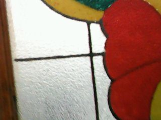
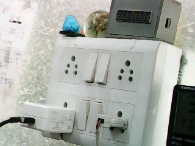
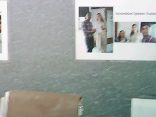
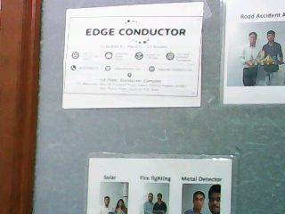
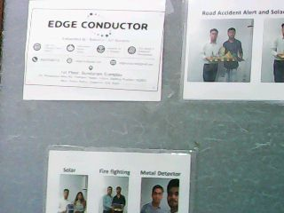
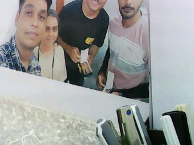

# ESP32-CAM Image Server

## Yeh Project Kya Karta Hai
ESP32-CAM ko WiFi se connect karke ek HTTP server chalata hai.
Browser mein IP address daalo aur seedha camera ki photo aa jaati hai.

## Humne Kya Kiya
- ESP32-CAM ko WiFi se connect kiya
- HTTP server banaya port 80 pe
- `/get_image/` endpoint banaya jo fresh JPEG photo deta hai
- RHYX M21-45 sensor ka issue fix kiya (RGB565 → JPEG convert)
- Browser mein Capture, Back aur Download button banaye

## Hardware
- ESP32-CAM module (RHYX M21-45 sensor)
- ESP32-CAM-MB shield (USB se flash karne ke liye)

## Problems Jo Aayi Aur Fix
| Problem | Fix |
|---|---|
| JPEG format not supported | RGB565 mode use kiya, phir `frame2jpg()` se convert kiya |
| COM5 port error | Tools → Port → COM4 select kiya |
| Camera init fail | RGB565 pixel format set kiya |

## API
| Endpoint | Kya Karta Hai |
|---|---|
| `GET /` | Main page — Capture/Back/Download buttons |
| `GET /get_image/` | Fresh JPEG photo return karta hai |

## Kaise Flash Kare
1. Arduino IDE mein Board → `AI Thinker ESP32-CAM` select karo
2. Port → `COM4` select karo
3. `WIFI_SSID` aur `WIFI_PASSWORD` apna bharo
4. IO0 button dabao + RST press karo → Upload karo
5. RST ek baar dabao → Serial Monitor mein IP dekho

## Kaise Use Kare
1. Serial Monitor kholo (115200 baud)
2. IP address dekho jaise `192.168.29.243`
3. Browser mein daalo: `http://192.168.29.243/`
4. **Capture** button dabao → photo aa jaayegi
5. **Download** button se photo save karo

## WiFi Setup
```cpp
const char* WIFI_SSID     = "Tumhara_WiFi_Naam";
const char* WIFI_PASSWORD = "Tumhara_Password";
```

## Libraries Used
- `esp_camera.h` — camera control
- `img_converters.h` — RGB565 to JPEG convert
- `WiFi.h` — WiFi connection
- `WebServer.h` — HTTP server

## Results / Output






